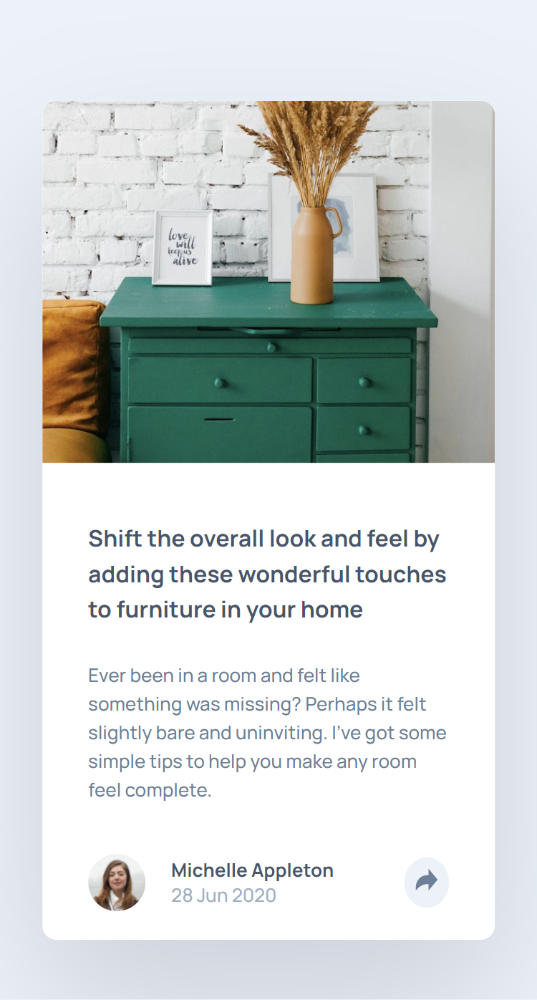
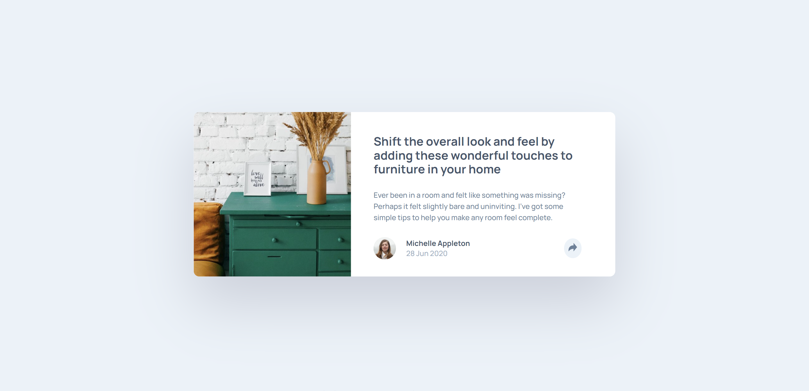

# Frontend Mentor - Article preview component solution

This is a solution to the [Article preview component challenge on Frontend Mentor](https://www.frontendmentor.io/challenges/article-preview-component-dYBN_pYFT). Frontend Mentor challenges help you improve your coding skills by building realistic projects.

## Table of contents

- [Overview](#overview)
  - [Links](#links)
  - [Screenshots](#screenshots)
- [My process](#my-process)
  - [Built with](#built-with)
- [Author](#author)

## Overview

### Links

- Live Site URL: [GitHubPage](https://thethomasy.github.io/Social-Proof-Section/)

### Screenshots

  
  

## My process

I built this component mobile first and then focused on the desktop layout. The card design is fairly simple so the majority of time and effort has gone into the share functionality. In the end I decided that the mobile and desktop "share interactions" differed enough to justify different HTML sections - although this would be the area to improve in this design.

### Built with

- HTML
- SASS
- Flexbox
- Mobile-first workflow

## Author

- Frontend Mentor - [@TheThomasY](https://www.frontendmentor.io/profile/TheThomasY)
